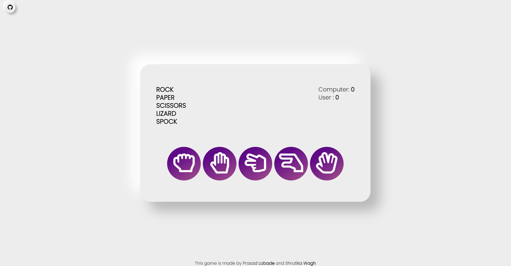

# [Rock-Paper_Scissor-Lizard-Spock]

    

This repositry contains the alternate version of the classic game "ROCK-PAPER-SCISSOR". 

"ROCK-PAPER-SCISSOR-LIZARD-SPOCK" is an alternate to the traditional game adding two more components to the game other than the traditional ROCK, PAPER, SCISSOR. The additional components being the "SPOCK" and "LIZARD". 

## Rules to Play the Game :

Scissor beats Paper<b>
Scissor beats Lizard<b>
Paper beats Rock<b>
Paper beats Spock<b>
Rock beats Scissor<b>
Rock beats Lizard<b>
Lizard beats Spock<b>
Lizard beats Paper<b>
Spock beats Scissor<b>
Spock beats Rock<b>

## Requirements :

These assignments has been tested and developed using the following libraries: 

    - python==3.2 or higher
    - eel == 0.8 or higher
    
We recommend using at least these versions of the required libraries or later. Python 2 is not supported.
    
## Ouput Glance :

    
